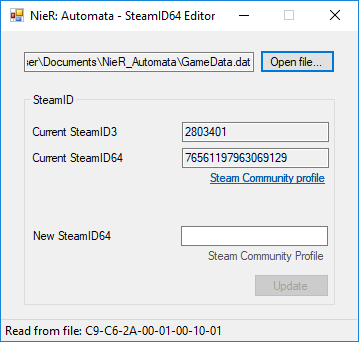

# NieR: Automata - SteamID64 Editor
Allows users to edit the SteamID64 stored in the save files of NieR:Automata. This tool have no dependency on existing save files, unlike other alternatives that rely on a correctly formatted GameData.dat file to function.

## Features
* Converts the stored SteamID64 to a human-readable format.
* Steam Community profile links for SteamID64 validation.
* No dependency on any existing save file.

## Requirement

* .NET Framework 4

## Usage
1. Download the editor from [the release section](https://github.com/Idearum/NieRAutomata-SteamID64-Editor/releases).

2. Run the tool and open one of the save files (\*.dat) of NieR:Automata:

   - **SlotData_#.dat** stores slot progression for slot 1-3.
   - **GameData.dat** stores general game progression, most obviously the main menu background.
   - **SystemData.dat** stores graphics settings.
   
3. Use https://steamid.xyz/, https://steamidfinder.com/, or https://steamid.co/ to locate the new SteamID64.

4. Copy/paste the new SteamID64 into the tool. Click on the 'Steam Community Profile' link to verify that the ID is correct.

5. Click on 'Update' to save the new ID to the file.

6. **For mass-editing**, leave the new SteamID64 in the field and open a new file and click on 'Update' immediately. Repeat until all files are updated.

## Preview

## Credits
- [jimmyazrael](https://github.com/jimmyazrael) for his initial [NierAutoModSave](https://github.com/jimmyazrael/NierAutoModSave) that showed that this was possible.

## License
See [LICENSE](LICENSE).
